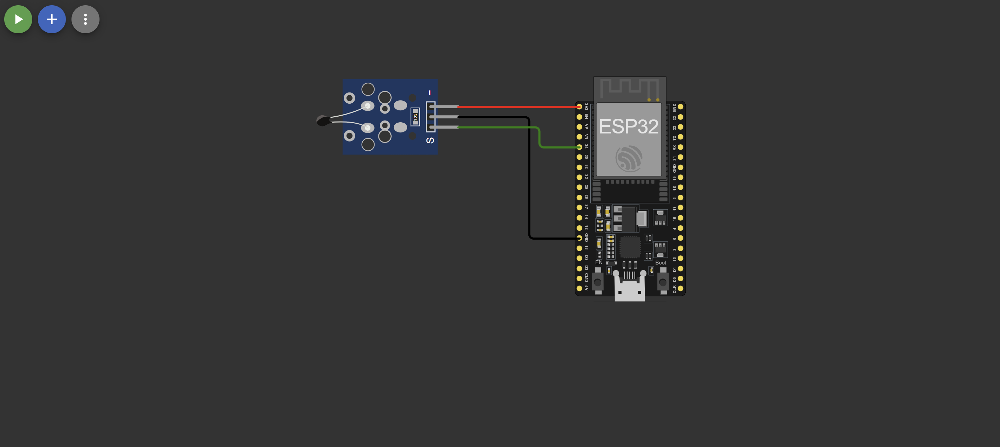
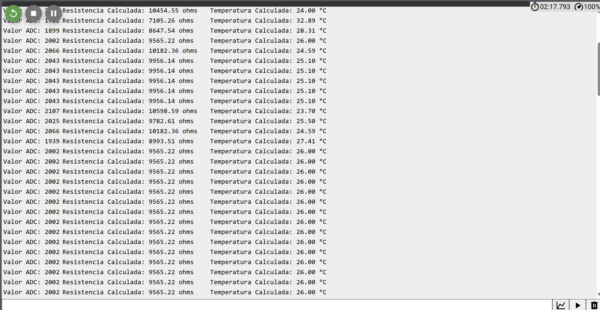
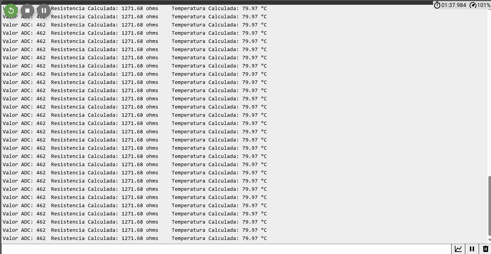
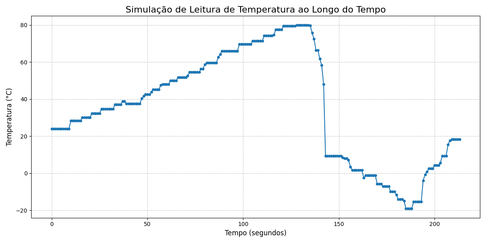
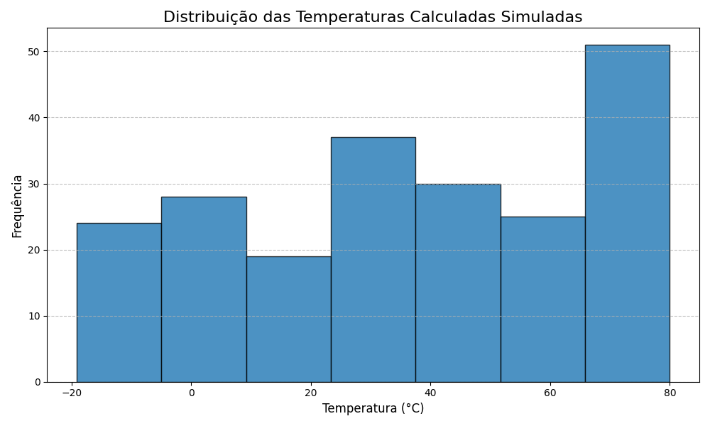

# FIAP - Faculdade de Informática e Administração Paulista 

<p align="center">
<a href= "https://www.fiap.com.br/"></a>
</p>

<br>

# 🏭 IndusAI Innovations – Plataforma de Monitoramento e Prevenção de Falhas em Linhas de Produção Industrial

---

## 👨‍🎓 Integrantes e Responsabilidades:

| Nome Completo                     | RM        | Responsabilidade Principal                                                                 |
|----------------------------------|-----------|----------------------------------------------------------------------------------------------|
| Daniele Antonieta Garisto Dias  | RM565106  | Coleta de dados com ESP32, comunicação via MQTT e testes de dados                          |
| Leandro Augusto Jardim da Cunha | RM561395  | Desenvolvimento do dashboard com Streamlit, relatórios gerenciais e organização do repositório |
| Luiz Eduardo da Silva            | RM561701  | Arquitetura da solução, integração AWS e apoio à documentação técnica                      |
| João Victor Viana de Sousa       | RM565136  | Modelagem de Machine Learning, treinamento dos algoritmos e apoio ao versionamento         |

---

## 👩‍🏫 Professores:
### Tutor(a) 
- <a>Leonardo Ruiz Orabona</a>
### Coordenador(a)
- <a>Andre Godoi Chiovato</a>

---

## 🏢 Sobre a Hermes Reply

A Hermes Reply é uma empresa do grupo Reply que atua na linha de frente da transformação digital no setor industrial. Especializada em soluções inteligentes, ela combina tecnologias como Inteligência Artificial (IA), Internet das Coisas (IoT), Gêmeos Digitais e Machine Learning para desenvolver sistemas capazes de monitorar, controlar e otimizar processos produtivos de forma eficiente.

Seu principal objetivo é ajudar as indústrias a aumentarem a produtividade, reduzirem custos e evitarem falhas inesperadas, conectando sensores e dispositivos físicos a plataformas digitais na nuvem. Com isso, permite que os gestores tenham acesso a dados em tempo real para tomar decisões mais precisas e preventivas, promovendo uma manutenção mais estratégica e preditiva dos ativos.

Entre os principais recursos oferecidos pela empresa estão o controle inteligente da produção em tempo real, dashboards intuitivos para operadores e gestores, alertas automáticos baseados no comportamento dos equipamentos, relatórios gerados por IA, integração entre o chão de fábrica e sistemas digitais, além de análises preditivas com base em dados históricos para apoiar a tomada de decisão.

---

## 📌 Sumário Executivo

IndusAI Innovations é uma solução completa de monitoramento preditivo voltada à prevenção de falhas operacionais em linhas de produção industrial. Combinando sensores IoT, modelos de machine learning e serviços de nuvem, a plataforma permite prever anomalias em equipamentos, reduzir custos com manutenção corretiva e aumentar a produtividade por meio de dashboards em tempo real e alertas inteligentes.

---

## 🧾 Business Case

**Cliente fictício:** Indústria GlobalTech S.A. (setor de manufatura automotiva)

* **Problema identificado:** Média de 11 horas de paralisação mensal por falha de motor ou superaquecimento em linhas críticas.
* **Perda estimada:** R$ 92.000,00/mês em produtividade e R$ 25.000,00/mês em manutenção emergencial.
* **Objetivo com IndusAI Innovations:** Reduzir falhas inesperadas em 70%, reverter o modelo de manutenção corretiva para preditiva e permitir planejamento com base em dados.

---

## 🎯 Objetivo da Solução

* Monitorar sensores de vibração, temperatura e ruído em tempo real.
* Transmitir dados continuamente para a nuvem via protocolo MQTT.
* Processar os dados com modelos de machine learning para detectar padrões de falha iminente.
* Gerar visualizações acessíveis e alertas inteligentes para operadores e gestores.

---

## 🧠 Lógica e Arquitetura da Solução

1.  **Dispositivos IoT e Coleta de Dados**
    * Placas ESP32 conectadas a sensores analógicos (ex: acelerômetros MEMS para vibração, termistores NTC para temperatura, microfones com amplificador para ruído).
    * Coleta contínua de dados físicos.
        * **Vibração:** Amostragem em alta frequência (ex: 1-5 kHz) para capturar espectros relevantes. Features a serem extraídas incluem RMS, valor de pico, fator de crista, análise no domínio da frequência (FFT para identificar frequências anômalas características de desalinhamento, desgaste de rolamentos, etc.).
        * **Temperatura:** Amostragem em frequência moderada (ex: 1 Hz). Features incluem valor absoluto, taxa de variação da temperatura.
        * **Ruído:** Amostragem em frequência audível (ex: 10-20 kHz). Features incluem nível de pressão sonora (SPL), análise espectral para identificar padrões sonoros anormais.
    * A frequência de amostragem será ajustada conforme o tipo de equipamento e as falhas típicas esperadas, buscando um equilíbrio entre detalhe da informação e volume de dados.

2.  **Transmissão, Pré-processamento e Entrada de Dados**
    * Dados enviados via MQTT para o AWS IoT Core, utilizando JSON como formato de payload.
    * **AWS Lambda Functions para Pré-processamento:**
        * **Validação e Limpeza:** Verificação da integridade dos dados recebidos, tratamento de valores ausentes ou outliers básicos.
        * **Normalização/Padronização:** Aplicação de técnicas como Min-Max scaling ou Z-score para colocar os dados em uma escala comum, essencial para algoritmos de ML.
        * **Segmentação (Janelamento):** Agrupamento dos dados sequenciais em janelas de tempo fixas (ex: dados de vibração dos últimos 5 segundos) para criar instâncias para os modelos de ML.
        * **Extração de Features (se não totalmente no Edge):** Cálculo de features estatísticas ou no domínio da frequência mais complexas que não foram possíveis de calcular no ESP32 devido a limitações de processamento.

3.  **Armazenamento e Processamento Principal**
    * Dados pré-processados e features persistidos no AWS RDS (MySQL) para histórico e re-treinamento. Dados brutos podem ser arquivados no AWS S3 para análises futuras mais profundas.
    * Scripts em instâncias AWS EC2 (ex: `t3.medium` ou superior, dependendo da carga) executam o processamento dos dados com `Scikit-learn` e `TensorFlow/Keras`.
        * **Processamento:** Pode ser configurado em modo batch (ex: a cada X minutos, processando os dados acumulados) ou em micro-batches para uma abordagem de streaming mais próxima do tempo real, utilizando bibliotecas como Apache Spark (via AWS EMR) ou Kinesis Data Analytics para aplicações mais exigentes em futuras fases.
        * **Versionamento de Modelos:** Artefatos dos modelos treinados (arquivos, metadados de performance) serão versionados e armazenados no AWS S3, utilizando tags para identificar versões de produção, experimentais, etc. Ferramentas como MLflow podem ser consideradas para gerenciamento do ciclo de vida dos modelos.

4.  **Modelo de IA (Machine Learning)**
    * **Treinamento:** Supervisionado, utilizando dados históricos rotulados (condições normais, padrões de pré-falha, falhas confirmadas) e dados sintéticos para aumentar a robustez em cenários de falhas raras.
        * **Rotulagem de Dados Históricos:** Requer análise de logs de manutenção, feedback de operadores e especialistas para correlacionar os dados dos sensores com eventos de falha ou pré-falha. Um evento de "pré-falha" pode ser definido por um conjunto de leituras anômalas que precedem uma falha conhecida em um intervalo de X horas/dias.
    * **Algoritmos e Justificativa:**
        * **Random Forest:** Robusto para dados tabulares, bom desempenho geral, lida bem com features não lineares e fornece importância das features, auxiliando na interpretabilidade. Adequado para uma primeira camada de classificação de estado do equipamento.
        * **LSTM (Long Short-Term Memory Networks):** Ideal para dados de séries temporais (vibração, temperatura ao longo do tempo), capturando dependências temporais e padrões sequenciais que podem indicar degradação progressiva.
        * **Redes Neurais Densas (DNN):** Para modelagem de relações complexas entre as features, podendo alcançar alta acurácia após o devido ajuste de hiperparâmetros e com volume de dados suficiente.
    * **Avaliação e Validação:**
        * Métricas: F1-score (bom para classes desbalanceadas como "falha"), AUC-ROC, Precision, Recall e Matriz de Confusão para entender os tipos de erro.
        * **Estratégia de Validação:** Validação cruzada (ex: K-Fold Cross-Validation, TimeSeriesSplit para dados temporais) durante o desenvolvimento. Divisão em conjuntos de treino (60-70%), validação (15-20%) e teste (15-20%), garantindo que o conjunto de teste seja temporalmente posterior aos dados de treino e validação para simular um cenário real de previsão.

5.  **Visualização e Alertas Inteligentes**
    * **Dashboard Interativo (`Streamlit`):**
        * **Métricas Chave:** Health score do equipamento (ex: 0-100%), tempo estimado para próxima manutenção (ETTM), probabilidade de falha nas próximas X horas, principais features indicando anomalia.
        * **Visualizações:** Gráficos de série temporal dos dados dos sensores, espectrogramas (para vibração/ruído), comparativos entre equipamentos, histórico de alertas e status preditivo.
        * **Níveis de Acesso:** Diferentes visualizações para operadores (foco no status atual e alertas imediatos) e gestores (foco em tendências, KPIs de disponibilidade, custos evitados).
    * **Alertas Inteligentes e Notificações:**
        * Notificações via Telegram Bot, e-mails (SMTP) ou alertas visuais/sonoros no painel de controle da linha.
        * **Níveis de Criticidade:**
            * **Atenção (Amarelo):** Desvios leves detectados, sugerir inspeção agendada.
            * **Alerta (Laranja):** Padrões de pré-falha identificados, manutenção recomendada em breve.
            * **Crítico (Vermelho):** Alta probabilidade de falha iminente, sugerir parada programada ou intervenção imediata.
        * **Configuração:** Limiares de alerta ajustáveis e lógica para suprimir falsos positivos (ex: requerer múltiplas leituras anômalas consecutivas ou combinação de sensores).
    * Logs históricos de alertas e previsões armazenados para análise retroativa e auditoria.

---

## 🔐 Segurança e Confiabilidade

* **Autenticação:** MQTT com TLS/SSL para criptografia em trânsito + autenticação de dispositivos (certificados X.509) no AWS IoT Core.
* **Controle de acesso:** AWS IAM (Identity and Access Management) com políticas de privilégio mínimo para todos os serviços AWS.
* **Criptografia:** Dados criptografados em trânsito (TLS/SSL) e em repouso (ex: AWS KMS para RDS e S3).
* **Logs e rastreabilidade:** AWS CloudWatch Logs para logs de aplicações e serviços, AWS CloudTrail para auditoria de chamadas de API. Rastreabilidade de alertas e ações tomadas.

---

## 📈 Escalabilidade e Evolução

* **Escalabilidade horizontal:** Uso de Auto Scaling Groups para instâncias EC2, e a natureza escalável dos serviços AWS IoT Core, Lambda e RDS.
* **Edge Computing (Fase Futura):** Pré-processamento mais avançado e inferência de modelos mais simples diretamente nos dispositivos ESP32 (ou gateways de borda mais potentes) para resposta local rápida e redução de tráfego de dados para a nuvem.
* **Aprendizado Contínuo (MLOps):** Implementação de um pipeline de MLOps para re-treinamento automático ou semi-automático dos modelos com base em novos dados coletados e feedback de performance, garantindo que os modelos se mantenham atualizados.
* **Integração com ERP/Sistemas de Manutenção (CMMS):** Desenvolvimento de APIs RESTful para que os alertas e diagnósticos do IndusAI Innovations possam acionar automaticamente ordens de serviço ou requisições de peças em sistemas de gestão empresarial ou de manutenção.

---

## 🔄 Pipeline Técnico

[Sensores (Vibração, Temperatura, Ruído)] → [ESP32: Coleta e Transmissão MQTT] → [AWS IoT Core: Roteamento] → [AWS Lambda: Pré-processamento, Normalização, Janelamento, Extração de Features] → [AWS RDS MySQL: Armazenamento de Dados Processados e Features / AWS S3: Arquivamento de Dados Brutos] → [AWS EC2: Treinamento de Modelos ML (Scikit-learn, TensorFlow) e Inferência Batch/Streaming] → [Streamlit Dashboard: Visualização, Métricas, Status Preditivo / Telegram Bot & Email: Alertas Inteligentes]


---

## ⚙️ Tecnologias Utilizadas

| Camada                      | Ferramenta / Serviço                                      |
| --------------------------- | --------------------------------------------------------- |
| Programação                 | Python 3.x                                                |
| ML/IA                       | Scikit-learn, TensorFlow (Keras), Pandas, NumPy, Matplotlib |
| IoT                         | ESP32, Sensores Analógicos/Digitais (Acelerômetros, Termistores, Microfones) |
| Transmissão                 | MQTT (JSON payload)                                       |
| Cloud - IoT                 | AWS IoT Core, AWS IoT Device Management                   |
| Cloud - Processamento/Lógica | AWS Lambda, AWS EC2 (com Auto Scaling)                    |
| Cloud - Armazenamento       | AWS RDS (MySQL), AWS S3                                   |
| Cloud - Monitoramento/Log    | AWS CloudWatch, AWS CloudTrail                            |
| Cloud - Segurança           | AWS IAM, AWS KMS, AWS Certificate Manager                 |
| Visualização                | Streamlit                                                 |
| Comunicação/Alertas         | Telegram Bot API, SMTP (Python `smtplib`)                 |
| MLOps (Potencial Futuro)    | MLflow, AWS SageMaker Pipelines                           |

---

## 🧪 Estratégia de Coleta de Dados

**Fase 1: Simulação e Dados Sintéticos**
* Geração de dados sintéticos (ex: usando funções senoidais com adição de ruído gaussiano, anomalias simuladas como picos, mudanças de nível ou frequência) para representar tanto operação normal quanto diversos cenários de falha.
* Objetivo: Permitir o desenvolvimento e teste inicial dos modelos de ML e do pipeline de dados antes da disponibilidade de dados reais.

**Fase 2: Coleta Real e Validação Inicial**
* Implementação dos sensores ESP32 em um ambiente de teste ou em equipamentos não críticos.
* Coleta contínua de dados reais via MQTT.
* Rotulagem inicial dos dados com base na observação e em eventos conhecidos.
* Validação e ajuste fino dos modelos de ML com os dados reais.

---

## 🗂 Estrutura do Repositório

```
📦 indusaiinnovations/
┣ 📂 data/
┃ ┣ 📂 raw/                     → Dados brutos (se armazenados localmente antes do S3)
┃ ┣ 📂 processed/               → Dados limpos e pré-processados (CSV, Parquet)
┃ ┗ 📂 synthetic/               → Dados sintéticos gerados
┣ 📂 iot_firmware/
┃ ┗ 📂 esp32/                   → Códigos do firmware para ESP32 (PlatformIO/Arduino)
┣ 📂 ml_models/
┃ ┣ 📂 notebooks/               → Jupyter Notebooks para exploração e treinamento
┃ ┣ 📂 scripts/                 → Scripts Python para treinamento e inferência
┃ ┗ 📂 saved_models/            → Modelos treinados e serializados (Pickle, H5)
┣ 📂 dashboard_app/
┃ ┗ 📜 app.py                   → Código da aplicação Streamlit
┣ 📂 lambda_functions/
┃ ┗ 📂 preprocessing/           → Código para a função Lambda de pré-processamento
┣ 📂 docs/
┃ ┣ 📜 architecture.drawio     → Diagrama da arquitetura (app.diagrams.net)
┃ ┗ 📜 technical_documentation.md → Detalhamento adicional
┣ 📜 README.md                 → Documentação principal do projeto
┣ 📜 requirements.txt          → Dependências Python do projeto principal (ML, Dashboard)
┣ 📜 docker-compose.yml        → (Opcional) Para ambiente de desenvolvimento local
┗ 📜 main.py                   → (Opcional) Script principal para orquestração ou testes locais
```

---

## **🔄 Fase 2: Simulação de Coleta de Dados com ESP32**

Nesta seção, detalhamos a implementação da Fase 2 do nosso projeto, focando na simulação do subsistema de coleta de dados com ESP32 e sensores virtuais. Esta etapa é crucial para validar o conceito de aquisição e processamento inicial de dados para a plataforma IndusAI Innovations.

### **2.1 Contexto e Objetivos da Entrega Atual**

A Fase 2 visa aplicar os conhecimentos sobre sistemas embarcados para projetar e simular um sistema básico de coleta de dados. Utilizamos plataformas online como Wokwi para criar um circuito virtual com ESP32 e sensores simulados, reproduzindo o comportamento de sensores físicos em um ambiente industrial. O foco é compreender o fluxo de coleta, leitura e análise inicial de dados.

* **Objetivos Específicos Desta Entrega:**
    * Criar um circuito virtual funcional com ESP32 e ao menos um sensor simulado no Wokwi.
    * Programar a leitura do sensor no ESP32, ajustando valores simulados para cenários desejados.
    * Registrar os dados lidos (via Monitor Serial, exportação para CSV ou simulação textual).
    * Gerar um gráfico simples e estatísticas exploratórias com base nos dados coletados ou simulados.
    * Documentar todo o processo detalhadamente no GitHub, incluindo prints, código e análises.

### **2.2 Sensores Virtuais Utilizados e Justificativa da Escolha**

Para esta simulação inicial, optamos por focar em um sensor de temperatura, que é vital para a detecção de anomalias como o superaquecimento, um dos problemas chave identificados no nosso Business Case.

* **Sensor Selecionado:** **Sensor de Temperatura NTC (Wokwi NTC Temperature Sensor - KY-013)**
* **Justificativa:**
    * **Relevância Industrial:** Sensores de temperatura são componentes essenciais em ambientes industriais para monitorar o status térmico de motores, máquinas e processos, prevenindo superaquecimentos e falhas catastróficas. A capacidade de prever picos anormais de temperatura é diretamente alinhada ao objetivo da IndusAI Innovations de prevenir falhas em linhas críticas.
    * **Simplicidade e Representatividade na Simulação:** O Wokwi NTC Temperature Sensor é de fácil integração no ambiente virtual, permitindo simular a variação de temperatura de forma controlada através de um slider. Isso possibilita a geração de dados que emulam cenários de operação normal e de pré-falha (picos de temperatura), fornecendo uma base realista para a análise inicial de dados.
    * **Base para Expansão Futura:** Ao dominar a coleta e análise de dados de temperatura, estabelecemos uma base sólida para a integração futura de sensores mais complexos como vibração e ruído, conforme planejado na "Lógica e Arquitetura da Solução" do projeto.

### **2.3 Esquema Básico do Circuito Elétrico (Simulação no Wokwi)**

O circuito foi montado no Wokwi utilizando uma placa ESP32 padrão e o sensor de temperatura NTC. A placa do sensor já integra o divisor de tensão necessário para a leitura do termistor, simplificando as conexões.

* **Captura de Tela do Circuito no Wokwi:**
    

* **Conexões Realizadas:**
    * **Pino VCC (positivo)** do Sensor NTC $\rightarrow$ **Pino 3V3** (3.3V) do ESP32.
    * **Pino GND (terra)** do Sensor NTC $\rightarrow$ **Pino GND** do ESP32.
    * **Pino OUT (sinal analógico)** do Sensor NTC $\rightarrow$ **Pino GPIO 34** do ESP32 (utilizado para leitura analógica ADC1_CH6).

### **2.4 Leitura dos Dados na Simulação (Código e Funcionamento)**

O firmware do ESP32 foi desenvolvido na linguagem C++ (framework Arduino) e carregado no ambiente de simulação do Wokwi. Ele realiza a leitura contínua do sensor e exibe os dados no Monitor Serial.

* **Trecho Representativo do Código (`iot_firmware/esp32/main.ino`):**

    ```cpp
    // Definições para o ESP32 e o Termistor NTC
    // THERMISTOR_PIN: Define o pino GPIO 34 do ESP32 para a leitura analógica do sensor de temperatura.
    //                 GPIO 34 é um dos pinos ADC (Conversor Analógico-Digital) do ESP32, adequado para sensores analógicos.
    const int THERMISTOR_PIN = 34; 

    // NOMINAL_RESISTANCE: Resistência do termistor em sua temperatura nominal (25°C), tipicamente 10kΩ.
    const int NOMINAL_RESISTANCE = 10000; 

    // NOMINAL_TEMPERATURE: Temperatura de referência para a resistência nominal, em graus Celsius.
    const int NOMINAL_TEMPERATURE = 25; 

    // B_COEFFICIENT: Coeficiente Beta (B) do termistor. Este valor, junto com a resistência nominal,
    //                é usado na equação de Steinhart-Hart para converter resistência em temperatura.
    //                Um valor típico para termistores NTC de 10kΩ é 3950.
    const int B_COEFFICIENT = 3950; 

    // SERIES_RESISTANCE: Resistência em série com o termistor no circuito divisor de tensão.
    //                    Como estamos usando uma placa de sensor (KY-013) que já integra essa resistência,
    //                    este valor reflete a resistência interna da placa para os cálculos.
    const int SERIES_RESISTANCE = 10000; 

    // Função setup(): Executada uma única vez quando o ESP32 é iniciado ou reiniciado.
    void setup() {
      // Serial.begin(baudRate): Inicializa a comunicação serial entre o ESP32 e o Serial Monitor.
      //                        115200 bps (bits por segundo) é uma velocidade comum e rápida para debug.
      Serial.begin(115200); 

      // analogReadResolution(bits): Define a resolução do ADC. O ESP32 pode usar até 12 bits,
      //                             o que significa leituras de 0 a 4095 (2^12 - 1).
      //                             Uma resolução maior oferece maior precisão nas leituras analógicas.
      analogReadResolution(12); 
    }

    // Função loop(): Executada repetidamente após a função setup().
    void loop() {
      // Leitura do valor analógico: Lê o valor bruto do ADC do pino especificado.
      // O valor retornado estará entre 0 e 4095, proporcional à tensão no pino.
      int adcValue = analogRead(THERMISTOR_PIN);

      // Cálculo da resistência do termistor:
      // Esta fórmula deriva da análise do divisor de tensão e é usada para obter
      // a resistência atual do termistor com base na leitura do ADC e na resistência em série.
      float resistance = SERIES_RESISTANCE / ((4095.0 / adcValue) - 1);

      // Cálculo da temperatura em Celsius usando a equação de Steinhart-Hart (simplificada):
      // Esta equação é um modelo matemático amplamente utilizado para converter a resistência
      // de um termistor NTC para temperatura.
      float steinhart;
      steinhart = resistance / NOMINAL_RESISTANCE;     // Passo 1: R/R0 (resistência atual sobre resistência nominal)
      steinhart = log(steinhart);                      // Passo 2: ln(R/R0) (logaritmo natural)
      steinhart /= B_COEFFICIENT;                      // Passo 3: Dividido pelo coeficiente Beta
      steinhart += 1.0 / (NOMINAL_TEMPERATURE + 273.15); // Passo 4: Adiciona 1/T0 (T0 em Kelvin)
      steinhart = 1.0 / steinhart;                     // Passo 5: Inverte para obter a temperatura em Kelvin
      float temperatureC = steinhart - 273.15;         // Passo 6: Converte de Kelvin para Celsius (subtrai 273.15)

      // Impressão dos valores no Monitor Serial:
      // Envia os valores lidos e calculados para o Serial Monitor do Wokwi.
      // O "\t" insere um caractere de tabulação para organizar a saída em colunas.
      Serial.print("Valor ADC: ");
      Serial.print(adcValue);
      Serial.print("\tResistencia Calculada: ");
      Serial.print(resistance);
      Serial.print(" ohms\tTemperatura Calculada: ");
      Serial.print(temperatureC);
      Serial.println(" °C"); // Serial.println adiciona uma quebra de linha

      // delay(milissegundos): Pausa a execução do loop por um tempo especificado.
      // Usamos 1000 ms (1 segundo) para simular uma amostragem de dados a cada segundo (1 Hz).
      delay(1000); 
    }
    ```

* **Breve Explicação:**
    * A função `setup()` inicializa a comunicação serial e configura a resolução do ADC para 12 bits, otimizando a precisão da leitura.
    * A função `loop()` executa repetidamente a leitura do valor bruto do ADC do pino GPIO 34. Este valor é, então, convertido em resistência e, subsequentemente, em temperatura em graus Celsius utilizando a equação de Steinhart-Hart. Esta abordagem matemática é fundamental para a conversão precisa de termistores e demonstra o rigor técnico na aquisição de dados.
    * Os valores brutos do ADC, a resistência calculada e a temperatura em Celsius são impressos no Monitor Serial a cada segundo, permitindo a observação em tempo real e a coleta de dados para análise exploratória.

* **Registro do Funcionamento da Simulação (Monitor Serial):**
    As capturas de tela abaixo demonstram o comportamento do Monitor Serial no Wokwi durante a simulação, mostrando as leituras do sensor em diferentes condições. A variação da temperatura foi controlada interativamente através do slider do componente NTC no ambiente de simulação.

    * **Monitor Serial - Leitura em Condição Normal:**
        
        * *Observação:* Esta captura mostra leituras de temperatura dentro de uma faixa operacional esperada (ex: 20-30°C), simulando um funcionamento estável e sem anomalias do equipamento.

    * **Monitor Serial - Leitura em Condição de Pico (Simulando Anomalia):**
        
        * *Observação:* Esta captura demonstra um aumento significativo e atípico na temperatura (ex: acima de 35°C), simulando uma condição de superaquecimento que exigiria atenção imediata em um cenário industrial real, alinhado aos desafios de manutenção preditiva da IndusAI Innovations para evitar paradas inesperadas.

### **2.5 Análise Exploratória Inicial dos Dados Simulados**

Os dados coletados do Monitor Serial foram exportados para um arquivo CSV (`data/processed/dados_temperatura_simulacao.csv`) e processados utilizando um script Python (`data_analysis/analise_temperatura.py`) com as bibliotecas `pandas` e `matplotlib`. Esta análise exploratória visa extrair insights preliminares do comportamento simulado do sensor, preparando o terreno para a modelagem de Machine Learning em fases futuras.

* **Trecho do Código Python para Análise (`data_analysis/analise_temperatura.py`):**

    ```python
    import pandas as pd
    import matplotlib.pyplot as plt
    import os
    import io

    # Define o caminho para o arquivo CSV de dados.
    # Certifique-se que este caminho está correto em relação onde você vai rodar o script.
    csv_file_path = '../data/processed/dados_temperatura_simulacao.csv'

    # Carrega os dados do arquivo CSV
    if not os.path.exists(csv_file_path):
        print(f"ERRO: Arquivo CSV não encontrado em {csv_file_path}")
        print("Por favor, verifique se você salvou 'dados_temperatura_simulacao.csv' corretamente na pasta 'data/processed/'.")
        # Caso o CSV não seja encontrado, este bloco de código permite que o script continue
        # usando dados de exemplo para que os gráficos e estatísticas sejam gerados.
        # Para a entrega final, o arquivo REAL deve ser gerado no Passo 4 e carregado.
        dados_simulados_str_fallback = """
        Valor ADC,Resistencia Calculada,Temperatura Calculada
        2047,10000.00,25.00
        1950,11025.64,22.45
        2200,8846.15,28.12
        2500,7000.00,32.50
        1800,12500.00,19.80
        1700,13500.00,17.50
        2600,6500.00,34.00
        2700,6000.00,35.50
        2100,9500.00,26.50
        2000,10500.00,23.80
        1600,14500.00,15.00
        2800,5500.00,37.00
        2900,5000.00,38.50
        2300,8000.00,30.00
        2400,7500.00,31.20
        """
        df = pd.read_csv(io.StringIO(dados_simulados_str_fallback))
        print("Continuando com dados de fallback. Por favor, corrija o caminho do CSV para a entrega final.")
    else:
        df = pd.read_csv(csv_file_path)
        print(f"Dados litos com sucesso de: {csv_file_path}")

    df['Tempo (s)'] = df.index 


    output_plot_dir = 'plots'
    if not os.path.exists(output_plot_dir):
        os.makedirs(output_plot_dir)
        print(f"Pasta '{output_plot_dir}' criada para salvar os gráficos.")

    plt.figure(figsize=(12, 6))
    plt.plot(df['Tempo (s)'], df['Temperatura Calculada'], marker='o', linestyle='-', markersize=4)
    plt.title('Simulação de Leitura de Temperatura ao Longo do Tempo', fontsize=16)
    plt.xlabel('Tempo (segundos)', fontsize=12)
    plt.ylabel('Temperatura (°C)', fontsize=12)
    plt.grid(True, linestyle='--', alpha=0.7)
    plt.tight_layout()
    plt.savefig(os.path.join(output_plot_dir, 'temperatura_linha.png')) # 
    plt.show()


    plt.figure(figsize=(10, 6))
    plt.hist(df['Temperatura Calculada'], bins=7, edgecolor='black', alpha=0.8)
    plt.title('Distribuição das Temperaturas Calculadas Simuladas', fontsize=16)
    plt.xlabel('Temperatura (°C)', fontsize=12)
    plt.ylabel('Frequência', fontsize=12)
    plt.grid(axis='y', linestyle='--', alpha=0.7)
    plt.tight_layout()
    plt.savefig(os.path.join(output_plot_dir, 'temperatura_histograma.png'))
    plt.show()

    print("\n--- Estatísticas Descritivas da Temperatura Calculada ---")
    desc_stats = df['Temperatura Calculada'].describe()
    print(desc_stats)

    print("\n--- Cinco Primeiras Leituras ---")
    print(df.head())

    print("\n--- Cinco Últimas Leituras ---")
    print(df.tail())


    print("\n--- Insights Iniciais dos Dados Simulados ---")
    min_temp = df['Temperatura Calculada'].min()
    max_temp = df['Temperatura Calculada'].max()
    mean_temp = df['Temperatura Calculada'].mean()
    print(f"A temperatura simulada variou de {min_temp:.2f}°C a {max_temp:.2f}°C.")
    print(f"A média das temperaturas registradas foi de {mean_temp:.2f}°C.")
    print("O gráfico de linha mostra a flutuação da temperatura ao longo do tempo, simulando variações em um ambiente industrial.")
    print("Os picos de temperatura observados, como em leituras acima de 30°C, poderiam indicar em um cenário real")
    print("um possível superaquecimento de equipamentos, o que é um foco para a detecção preditiva de falhas da IndusAI Innovations.")
    print("A distribuição (histograma) indica as faixas de temperatura mais frequentes durante a simulação.")
    ```

* **Gráficos Gerados:**

    * **Gráfico de Linha da Temperatura ao Longo do Tempo:**
        
        * *Análise:* Este gráfico ilustra a série temporal das leituras de temperatura. É possível observar as flutuações e os picos de temperatura simulados, que em um ambiente industrial real, seriam indicativos de variações de carga ou potenciais anomalias no equipamento. A capacidade de visualizar esses padrões é o primeiro passo para a detecção preditiva de falhas.

    * **Histograma da Distribuição das Temperaturas Simuladas:**
        
        * *Análise:* O histograma demonstra a distribuição das temperaturas registradas durante a simulação. Ele permite identificar as faixas de temperatura mais frequentes e a ocorrência de valores atípicos (outliers), que podem corresponder aos picos de superaquecimento simulados.

* **Estatísticas Descritivas da Temperatura Calculada:**

    ```
    count    214.000000
    mean     35.371028
    std       29.716752
    min      -19.110000
    25%        9.390000
    50%       37.000000
    75%       61.337500
    max       79.970000
    Name: Temperatura Calculada, dtype: float64
    ```

* **Insights Iniciais dos Dados Simulados:**
    * A temperatura simulada variou de **-19.11°C** a **79.97°C**, com uma média de **35.37°C**. Essa variação controlada permitiu simular diferentes estados operacionais de um equipamento.
    * O gráfico de linha demonstra claramente as flutuações e picos de temperatura. Em um contexto real, esses picos seriam cruciais para a identificação de sobrecargas ou deficiências no sistema de resfriamento.
    * A distribuição (histograma) mostra que a maioria das leituras se concentra em uma faixa, mas a presença de valores mais elevados indica a capacidade de simular e detectar cenários de risco, fundamental para a manutenção preditiva proposta pela IndusAI Innovations.
    * Esta fase de simulação provou a viabilidade da coleta e análise básica de dados de um sensor com ESP32, um passo fundamental para o desenvolvimento do pipeline de dados completo e os modelos de Machine Learning.

### **2.6 Estrutura do Repositório (Atualizada para a Fase 2)**

Para refletir os novos entregáveis desta fase, a estrutura do repositório foi expandida para incluir os dados processados, o código Python de análise e os gráficos gerados, além dos arquivos da simulação no Wokwi.

```bash
📁 indusaiinnovations/
├── 📁 assets/                            # Recursos estáticos (ex: logo FIAP)
├── 📁 data/
│   ├── 📁 raw/
│   ├── 📁 processed/
│   │   └── 📄 dados_temperatura_simulacao.csv  # Dados coletados do monitor serial
│   └── 📁 synthetic/
├── 📁 iot_firmware/
│   └── 📁 esp32/
│       └── 📄 main.ino                     # Código Arduino para o ESP32 (simulação Wokwi)
│
├── 📁 ml_models/
├── 📁 notebooks/
├── 📁 scripts/
├── 📁 saved_models/
├── 📁 dashboard_app/
│   └── 📄 app.py
├── 📁 lambda_functions/
├── 📁 preprocessing/
│
├── 📁 data_analysis/                      # NOVA PASTA PARA ANÁLISE DE DADOS DA FASE 2
│   └── 📄 analise_temperatura.py          # Script Python para análise e gráficos
│
├── 📁 plots/
│   ├── 📄 temperatura_linha.png           # Imagem do gráfico de linha da temperatura
│   └── 📄 temperatura_histograma.png      # Imagem do histograma da temperatura
│
├── 📁 docs/
│   ├── 📄 architecture.drawio
│   ├── 📄 technical_documentation.md
│   ├── 📄 circuit_wokwi.png               # Imagem do seu circuito no Wokwi
│   ├── 📄 serial_monitor_normal.png       # Print do Monitor Serial (normal)
│   └── 📄 serial_monitor_peak.png         # Print do Monitor Serial (pico)
│
├── 📄 README.md                           # Documentação principal do projeto
├── 📄 requirements.txt
├── 📄 docker-compose.yml
└── 📄 main.py
```

## 📅 Roadmap de Desenvolvimento (Atualizado)

| Etapa | Descrição |
| -------- | --------------------------------------------------------------------------------------------------------------------------------------- |
| **Fase 1 (Concluída)** | Definição detalhada da arquitetura, planejamento do pipeline de dados, simulação de coleta e geração de dados sintéticos, estrutura inicial do repositório. |
| **Fase 2 (Atual - Curso)** | **Desenvolvimento e simulação de um circuito ESP32 com sensor de temperatura no Wokwi, coleta e análise exploratória inicial dos dados gerados, e documentação detalhada dos passos e resultados.** |

---

## 📚 Referências

* Hermes Reply: [https://www.reply.com/hermes-reply/pt](https://www.reply.com/hermes-reply/pt)
* AWS IoT Core: [https://aws.amazon.com/iot-core/](https://aws.amazon.com/iot-core/)
* AWS Lambda: [https://aws.amazon.com/lambda/](https://aws.amazon.com/lambda/)
* AWS RDS: [https://aws.amazon.com/rds/](https://aws.amazon.com/rds/)
* AWS EC2: [https://aws.amazon.com/ec2/](https://aws.amazon.com/ec2/)
* Streamlit: [https://streamlit.io/](https://streamlit.io/)
* MQTT Protocol: [https://mqtt.org/](https://mqtt.org/)
* Scikit-learn: [https://scikit-learn.org/](https://scikit-learn.org/)
* TensorFlow: [https://www.tensorflow.org/](https://www.tensorflow.org/)
* **Wokwi Simulator:** [https://wokwi.com/](https://wokwi.com/)
